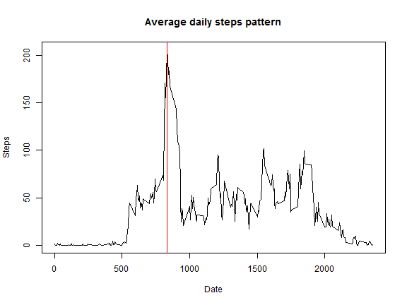
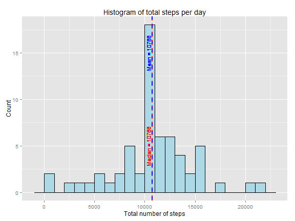

# Submission for "Reproducible Research: Peer Assessment 1"

## Introduction

With the proliferation of personal activity monioring devices, it is now possible to get data on personal movements and behaviour. This exercise uses R to explore the data collected from a personal activity monitoring device which collects data at 5 minute intervals through out the day. The dataset consists of two months of data collected during the months of October and November, 2012 and include the number of steps taken in 5 minute intervals each day.

## Loading and preprocessing the data
First of all, the data is read using read.csv function.


```r
act <- read.csv("data/activity.csv", header = TRUE, na.strings = "NA", colClasses = c("integer", 
    "Date", "integer"))
```


The dataset has 17568 rows and 3 columns with the following column names: steps, date, interval.

## Exploring mean total number of steps taken per day
The following code uses plyr to summarize the data by calculating sum of number of steps for each day.


```r
require(plyr)
```

```
## Loading required package: plyr
```

```r
stepsPerDay <- ddply(act, c("date"), function(xdf) {
    sum <- sum(xdf$steps, na.rm = TRUE)
    return(data.frame(sum))
})
```


This gives the dataframe ```stepsPerDay``` with sum of steps per day.

```r
head(stepsPerDay, 8)
```

```
##         date   sum
## 1 2012-10-01     0
## 2 2012-10-02   126
## 3 2012-10-03 11352
## 4 2012-10-04 12116
## 5 2012-10-05 13294
## 6 2012-10-06 15420
## 7 2012-10-07 11015
## 8 2012-10-08     0
```


The following code calculates the mean and median total number of average steps per day.


```r
meanSteps <- mean(stepsPerDay$sum)
medianSteps <- median(stepsPerDay$sum)
print(list(mean = meanSteps, median = medianSteps))
```

```
## $mean
## [1] 9354
## 
## $median
## [1] 10395
```


The following code plots the histogram of the total number of steps taken each day using ```ggplot2``` function.


```r
require(ggplot2)
```

```
## Loading required package: ggplot2
```

```r
hplot1 <- ggplot(stepsPerDay, aes(x = sum)) + geom_histogram(binwidth = 1000, 
    colour = "black", fill = "lightgrey")
hplot1 <- hplot1 + geom_vline(data = stepsPerDay, aes(xintercept = mean(sum, 
    na.rm = T)), size = 1, linetype = 2, colour = "blue") + geom_vline(data = stepsPerDay, 
    aes(xintercept = median(sum, na.rm = T)), size = 1, linetype = 2, colour = "red") + 
    geom_text(aes(mean(sum, na.rm = T) - 400, 7.5, label = paste0("Mean = ", 
        as.character(round(mean(sum, na.rm = T)), 2))), angle = 90, color = "blue", 
        size = 4, data = stepsPerDay) + geom_text(aes(median(sum, na.rm = T) - 
    400, 7.5, label = paste0("Median = ", as.character(round(median(sum, na.rm = T)), 
    2))), angle = 90, color = "red", size = 4, data = stepsPerDay) + xlab("Total number of steps") + 
    ylab("Count") + theme(legend.justification = "right", legend.position = c(0.25, 
    0.3)) + scale_fill_discrete(name = "Experimental\nCondition") + ggtitle("Histogram of total steps per day") + 
    theme_bw()
hplot1
```

 


## Exploring the average daily activity pattern

The following code plots a time series plot of the 5-minute interval and the average number of steps taken, averaged across all days.


```r
stepsPerInterval <- ddply(act, c("interval"), function(xdf) {
    sum <- sum(xdf$steps, na.rm = TRUE)
    mean <- mean(xdf$steps, na.rm = TRUE)
    median <- median(xdf$steps, na.rm = TRUE)
    return(data.frame(cbind(sum, mean, median)))
})
with(stepsPerInterval, plot(interval, mean, type = "n", main = "Average daily steps pattern", 
    ylab = "Steps", xlab = "Date"))
with(stepsPerInterval, lines(interval, mean))
with(stepsPerInterval, abline(v = stepsPerInterval[stepsPerInterval$sum == max(stepsPerInterval$sum), 
    c(1)], col = "red"))
```

 


The following code calculates particular 5-minute interval which contains the maximum number of steps.


```r
stepsPerInterval[stepsPerInterval$sum == max(stepsPerInterval$sum), ]
```

```
##     interval   sum  mean median
## 104      835 10927 206.2     19
```


## Imputing missing values
The following code calculate the total number of missing values in the dataset.

```r
sum(is.na(act$steps))
```

```
## [1] 2304
```


The following code imputes the NA values with average number of steps across the dataset for that particular time interval. The new dataset ```act2``` contains the steps with NAs imputed using the avrage numbers for the particular time interval.


```r
getMeanSteps <- function(xinterval) {
    value <- NULL
    for (i in 1:length(xinterval)) {
        value <- c(value, stepsPerInterval[stepsPerInterval$interval == xinterval[i], 
            c(3)])
    }
    return(value)
}
act2 <- act
nax <- which(is.na(act2$steps))
act2$steps[nax] <- getMeanSteps(act2$interval[nax])
tail(act2)
```

```
##        steps       date interval
## 17563 2.6038 2012-11-30     2330
## 17564 4.6981 2012-11-30     2335
## 17565 3.3019 2012-11-30     2340
## 17566 0.6415 2012-11-30     2345
## 17567 0.2264 2012-11-30     2350
## 17568 1.0755 2012-11-30     2355
```


 
This gives the data with sum of steps per day.


```r
stepsPerDay2 <- ddply(act2, c("date"), function(xdf) {
    sum <- sum(xdf$steps, na.rm = TRUE)
    return(data.frame(sum))
})
```


and Calculate and report the mean and median total number of steps taken per day. Do these values differ from the estimates from the first part of the assignment? What is the impact of imputing missing data on the estimates of the total daily number of steps?


```r
head(stepsPerDay2, 10)
```

```
##          date   sum
## 1  2012-10-01 10766
## 2  2012-10-02   126
## 3  2012-10-03 11352
## 4  2012-10-04 12116
## 5  2012-10-05 13294
## 6  2012-10-06 15420
## 7  2012-10-07 11015
## 8  2012-10-08 10766
## 9  2012-10-09 12811
## 10 2012-10-10  9900
```

Calculate mean and median

```r
# mean
meanSteps <- mean(stepsPerDay2$sum)
# median
medianSteps <- median(stepsPerDay2$sum)
print(list(mean = meanSteps, median = medianSteps))
```

```
## $mean
## [1] 10766
## 
## $median
## [1] 10766
```


The following code creates a histogram of the total number of steps taken each day.


```r
require(ggplot2)
hplot2 <- ggplot(stepsPerDay2, aes(x = sum)) + geom_histogram(binwidth = 1000, 
    colour = "black", fill = "lightblue") + # geom_density(alpha=.2, colour='red3') +
geom_vline(data = stepsPerDay2, aes(xintercept = mean(sum, na.rm = T)), size = 1, 
    linetype = 2, colour = "blue") + geom_vline(data = stepsPerDay2, aes(xintercept = median(sum, 
    na.rm = T)), size = 1, linetype = 3, colour = "red") + xlab("Total number of steps") + 
    ylab("Count") + ggtitle("Histogram of total steps per day")
hplot2
```

 

## Are there differences in activity patterns between weekdays and weekends?

```r
is.weekend <- function(xdate) {
    if (weekdays(xdate) == "Saturday" | weekdays(xdate) == "Sunday") {
        return("Weekend")
    } else {
        return("Weekday")
    }
}
act2$weekend <- sapply(act2$date, is.weekend)
act2$weekend <- factor(act2$weekend)
```

Plot

```r
stepsPerIntervalWeek <- ddply(act2, c("weekend", "interval"), function(xdf) {
    sum <- sum(xdf$steps, na.rm = TRUE)
    mean <- mean(xdf$steps, na.rm = TRUE)
    median <- median(xdf$steps, na.rm = TRUE)
    return(data.frame(cbind(sum, mean, median)))
})
plot3 <- qplot(interval, sum, data = stepsPerIntervalWeek, geom = c("line"), 
    method = "lm", xlab = "Year", ylab = "Total emissions in tons", main = "Trend in total PM2.5 emissions from coal related combustion in United States") + 
    theme(legend.position = "bottom") + theme_bw() + facet_wrap(~weekend, ncol = 1)
plot3
```

 


